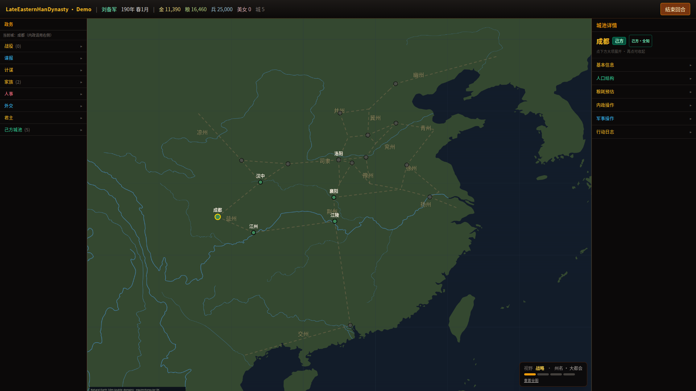
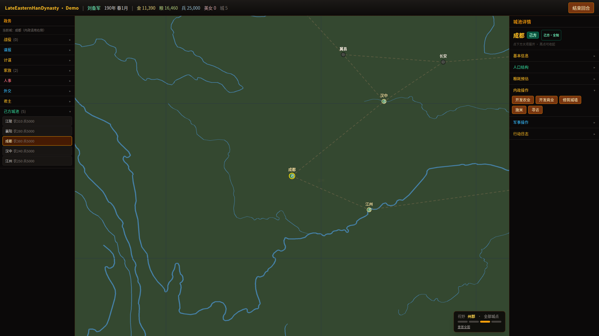
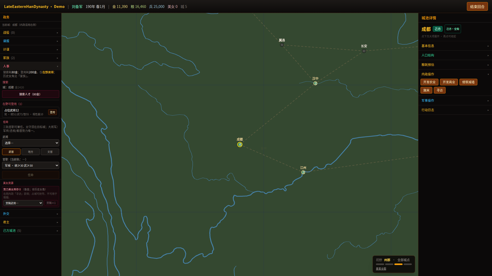
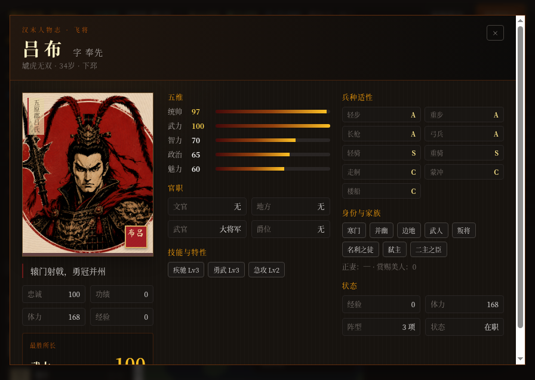
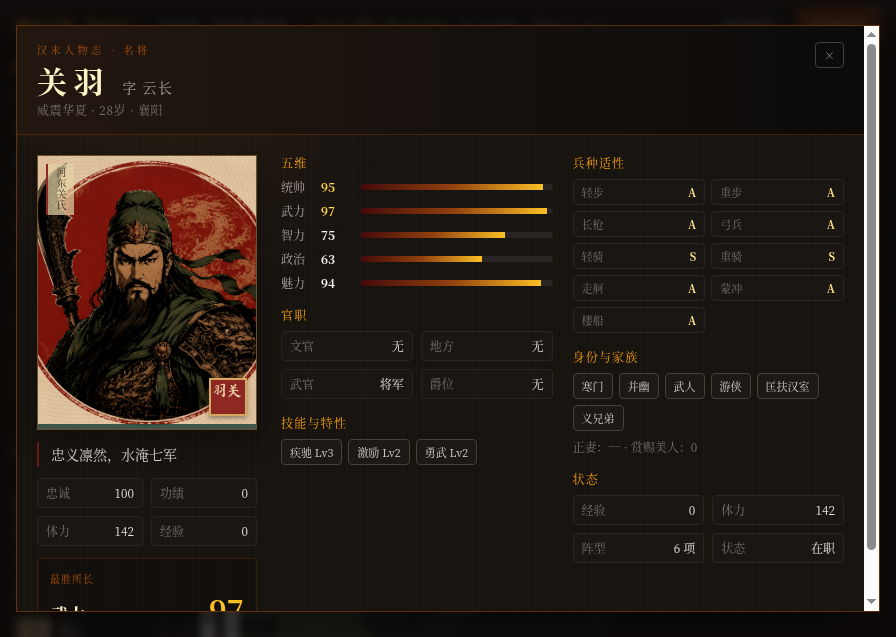
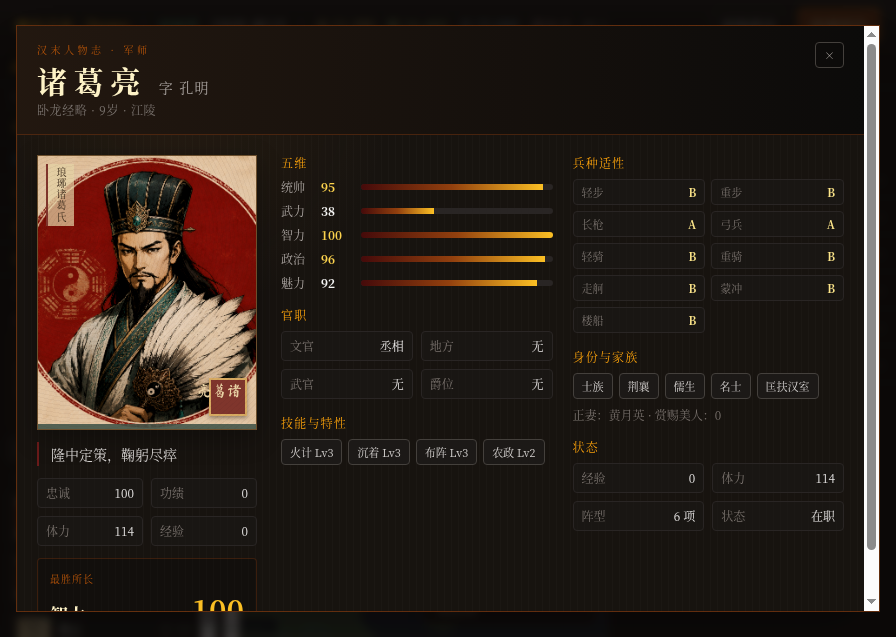
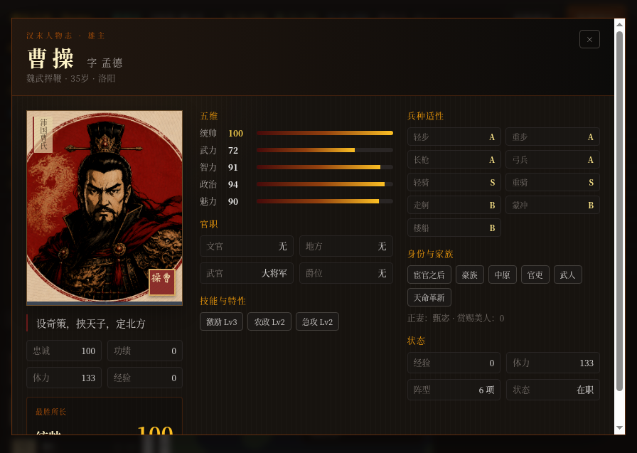

# Late Eastern Han Dynasty

> **Open-source historical strategy simulation framework** for modeling the late Eastern Han era through data-driven rules, turn-based state transitions, campaign systems, and a playable web reference client.
>
> 面向东汉末年历史题材的**开源历史策略模拟框架**：以数据驱动规则、回合状态演算、战役系统和可运行 Web 客户端验证历史策略玩法。

[](https://github.com/CtxPilot/Late-Eastern-Han-Dynasty/actions/workflows/ci.yml)
[](LICENSE)


The repository is both a framework under active development and a playable reference implementation—not a finished game or a reusable npm package yet. Its main engineering value is the separation of validated historical data, shared simulation contracts, server-side rule engines, and a Canvas-based client.

本仓库同时包含持续开发中的框架与可玩参考实现，**目前不是完整游戏，也尚未发布为通用 npm 包**。项目重点是验证：历史数据校验、共享模拟合约、服务端规则引擎与 Canvas 客户端能否以清晰边界共同演进。

## Why this repository exists

- Provide reusable architectural patterns for data-heavy historical strategy simulations.
- Keep simulation rules on the server and shared contracts in a framework-neutral TypeScript package.
- Treat historical records, inferred material, and fictionalized gameplay content as distinct source layers.
- Validate a small but complete scenario before scaling to the full historical dataset.
- Demonstrate an original, copyright-conscious visual language based on public-domain historical materials.

## Current status and honest scope

The **0-A playable prototype** currently includes:

- a 30-city simulation baseline, 9 unit types, 6 implemented formations, and 223 historical officer records;
- two selectable scenarios: a sandbox-style hero assembly and a four-faction 190 CE historical slice;
- seasonal turns, city development, recruitment, training, personnel actions, population/food consumption, diplomacy, intelligence, plots, family events, and server-side fog-of-war masking;
- campaign armies with commander/deputy/adviser composition, marching, sieges, simplified facilities, and automatic battle resolution;
- tactical hex combat, tactics, duel resolution, critical/counter/chain attacks, and a simplified close-combat mode;
- 24 scenario events across five narrative lines with player choices and source-layer labels.

Important limitations:

- AI domestic behavior and several campaign calculations remain deliberately simplified.
- Save/load, full historical scenarios, delegated armies, private retinues, farming colonies, full formation progression, and the duel tournament are not implemented.
- Several systems documented in `docs/` are designs or technical reserves; they are explicitly marked as such.
- Automated tests currently focus on 100 shared contract/pure-function tests plus dedicated engine verification scripts; this is not full end-to-end coverage.

For the precise playable path and known boundaries, see [Demo build and playbook](docs/16-demo-build-playbook.md). For implementation maturity by system, see [System map](docs/12-system-map.md).

## Screenshots

| Map and territories | City operations | Officer roster |
|:---:|:---:|:---:|
|  |  |  |

The four featured officer profiles use the project's new ink-and-cinnabar portrait set; the remaining roster keeps the original SVG/CSS procedural fallback.

| Lü Bu | Guan Yu | Zhuge Liang | Cao Cao |
|:---:|:---:|:---:|:---:|
|  |  |  |  |

## Quick start

Requirements: Node.js 20+ and pnpm 9.15.x.

```bash
pnpm install
pnpm --filter @leh/shared build
pnpm dev
```

Open `http://localhost:5173`; the API server runs on `http://localhost:3001`. On first launch, select a scenario and faction.

The bundled CJK font binaries are intentionally excluded from Git. Follow [client/public/fonts/README.md](client/public/fonts/README.md) if the local assets are absent.

## Validation

```bash
pnpm build
pnpm typecheck
pnpm lint
pnpm test
pnpm verify-campaign
pnpm verify-save-entities
pnpm verify-save-campaign
pnpm verify-save-battle
pnpm verify-save-diplomacy
pnpm verify-save-intel
pnpm verify-save-plot
pnpm verify-save-game-state
pnpm verify-save-migration
pnpm verify-battle-rng
pnpm verify-duel-rng
pnpm verify-civil-rng
pnpm verify-plot-spy-rng
pnpm verify-personnel-rng
pnpm verify-family-rng
pnpm verify-beauty-rng
pnpm verify-grand-strategist-rng
pnpm verify-ai-military-rng
pnpm verify-march-fog
pnpm verify-battle-commanders
pnpm validate-data
pnpm verify-scenario-events
```

The default CI includes the deterministic campaign engine integration check (62 assertions), save-entity (10), save-campaign (9), three-tier battle-boundary (24), diplomacy-state (11), intel-state (12), plot-state (9), complete GameState cross-reference (10), v1 save-migration/runtime-restore/PRNG (19), battle deterministic-continuation (5), duel deterministic-continuation (3), civil deterministic-continuation (12), plot/spy deterministic-continuation (30), personnel deterministic-continuation (32), family deterministic-continuation (32), beauty-resource deterministic-continuation (25), grand-strategist deterministic-continuation (28), AI-military resolution deterministic-continuation (7), fog-masked march authority-boundary (7), and battle-commander presentation checks across every current scenario/player perspective. Dedicated critical-hit, child-engine, and fire-tactic verification scripts remain available in `server/src/scripts/` and are documented in [CONTRIBUTING.md](CONTRIBUTING.md).

## Architecture

```text
client/   React + Vite + Konva reference UI
   │
   ├── REST / WebSocket
   ▼
server/   Express API, game orchestration, simulation engines, validated JSON data
   │
   ▼
shared/   TypeScript contracts, Zod schemas, enums, and deterministic utilities

docs/     Rules, data dictionary, architecture decisions, progress, and playbooks
```

| Layer | Technology | Responsibility |
|:--|:--|:--|
| Client | React 18, TypeScript, Vite, Konva, Zustand, Tailwind | Reference interface and Canvas visualization |
| Server | Express, TypeScript, WebSocket | Authoritative state and simulation rules |
| Shared | TypeScript, Zod | Contracts, validation, and pure utilities |
| Tests | Vitest + verification scripts | Pure-function and engine regression checks |

The project uses a pnpm monorepo. Static data is validated through Zod before it reaches the simulation. `docs/08-data-dictionary.md` is the single source of truth for dataset scale, while `docs/12-system-map.md` records system maturity.

## Development roadmap

Near-term priorities are to harden the framework before expanding the dataset:

1. improve automated engine and end-to-end coverage;
2. implement BF-P1 on top of the completed Nanjun historical-geography schema: enter the commandery battlefield, march between county nodes, resolve an encounter, and write results back once;
3. deepen the now-integrated CampaignArmy military AI beyond its current single-army/simple-formation baseline;
4. remove 0-A simplifications in facilities, formation modifiers, and campaign resolution;
5. add durable save/load support;
6. prepare a reproducible public demo and the first tagged pre-release;
7. only then expand toward the full 0-B historical dataset.

See [ROADMAP.md](ROADMAP.md) for the contributor-facing plan and [docs/09-roadmap.md](docs/09-roadmap.md) for the detailed engineering backlog.

## Contributing

Contributions are welcome, especially in tests, historical-source review, data validation, accessibility, documentation, and isolated engine improvements.

Please read [CONTRIBUTING.md](CONTRIBUTING.md), [CODE_OF_CONDUCT.md](CODE_OF_CONDUCT.md), and the repository rules in [AGENTS.md](AGENTS.md) before opening a pull request. Security issues should follow [SECURITY.md](SECURITY.md), not a public issue.

## Originality, historical sources, and assets

This is an independent original project. It is not affiliated with, endorsed by, or derived from Koei Tecmo, Baidu's San framework, or any commercial game franchise. Historical names and events are researched from public-domain classical sources; gameplay rules, code, interface composition, and programmatic art are original to this project.

Source code is licensed under the [MIT License](LICENSE). Media and font assets may use separate licenses; provenance and attribution are recorded in [CREDITS.md](CREDITS.md) and [client/public/fonts/README.md](client/public/fonts/README.md).

## Maintainer documentation

- [Architecture](docs/02-architecture.md)
- [Data models](docs/03-data-models.md)
- [Game systems](docs/04-game-systems.md)
- [API design](docs/06-api-design.md)
- [Data dictionary](docs/08-data-dictionary.md)
- [Progress log](docs/10-progress.md)
- [Learning and contribution guide](docs/18-learning-guide.md)
- [Design proposal templates](docs/19-design-proposal-templates.md)
- [Architecture hardening audit](docs/20-architecture-hardening-audit.md)
- [Session handoff](HANDOFF.md)
