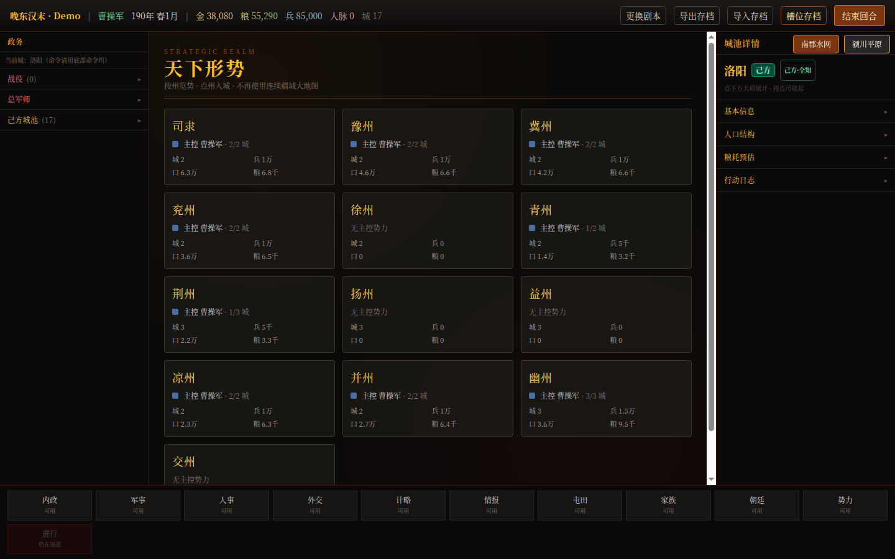
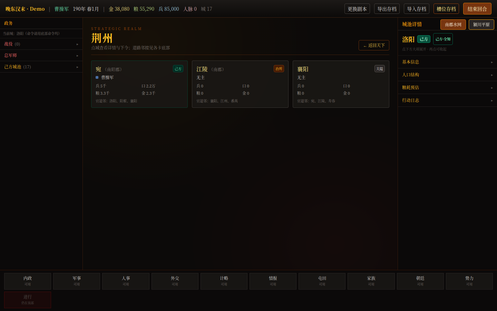
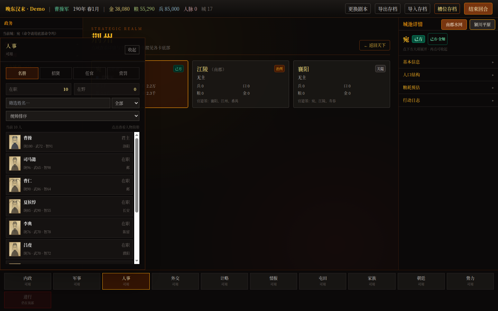
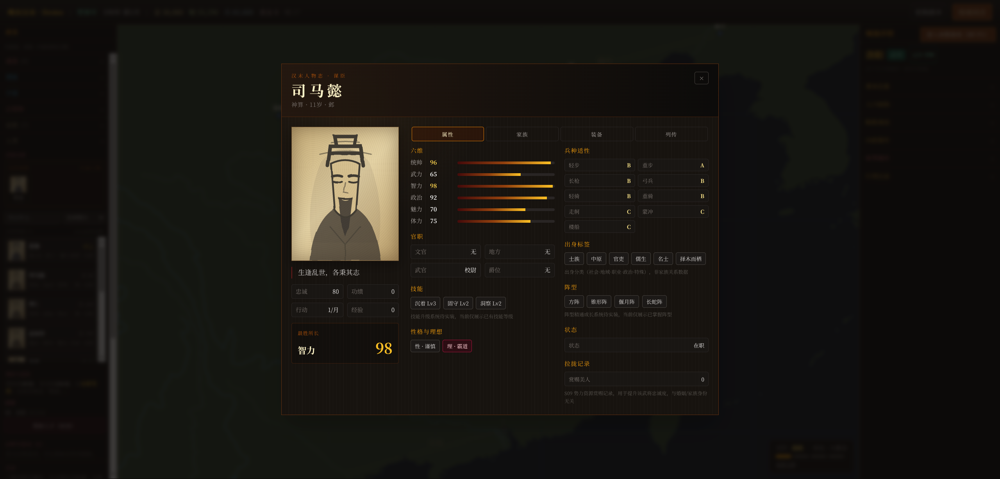

# Late Eastern Han Dynasty · 晚东汉末 · 三国争霸

[](https://github.com/CtxPilot/Late-Eastern-Han-Dynasty/actions/workflows/ci.yml)
[](LICENSE)


A turn-based grand strategy set in the dying years of the Eastern Han: you lead one faction of warlords toward hegemony — govern cities, raise officers, forge campaign armies, and win on the tactical grid, in the standard-mode melee, and in single combat. It is a **playable, open-source original** built from public-domain historical records — not a commercial release, and not a derivative of any commercial game.

一款以东汉末年为舞台的**回合制历史大战略游戏**：你统领一方势力，经营城池、招贤纳士、编成大军，在六角战棋、白刃战阵与武将单挑中逐鹿天下。这是**可玩的原创开源项目**，素材基于公有领域史料——既非商业成品，也不复刻任何商业游戏。

---

## The Game · 这是怎样一款游戏

**EN** — It is 190 CE. The Han court has lost its grip, and warlords rise across thirteen provinces. Pick a scenario and a faction, then play the classic grand-strategy loop:

1. **Govern** — develop agriculture, trade and city walls; recruit and train troops; feed your people through droughts and winters.
2. **Gather talent** — search for officers, recruit them, appoint them to three parallel career tracks (civil, military, nobility), marry and raise historically grounded families.
3. **Campaign** — assemble an army with a commander, deputy commanders, an adviser and five-position squads; march roads, besiege cities, choose assault or surrender.
4. **Fight** — resolve battles through three synchronized entrances (automatic resolution, standard close-combat, tactical hex micro-control) and single duels, with critical/counter/chain attacks, morale, organization, and formation mastery.
5. **Rise** — capture cities, earn merit and climb a 20-level rank system, play the court factions, and finally claim a royal title and empire.

Underneath are 27 interlocking systems, including hidden attributes, faction politics and fame, the Hegemony-Court line, treasure equipment, relationship webs, skill trees, espionage and ploys, and data-driven commandery battlefields with fog of war, real supply lines and AI reinforcement. The 0-A slice today ships 223 officers, 30 cities, 9 unit types and 7 selectable formations (six basics plus the charge wedge); the paused 0-B expansion targets 1000+ officers, 105 cities, 27 formations and 21 unit types.

**中文** — 公元 190 年，汉室倾颓，群雄并起于十三州。选择剧本与势力后，你按经典大战略循环经营全局：

1. **经营**：开发农业、商业与城防，征兵、训练，在旱涝寒冬中养活你的子民。
2. **求贤**：搜索与登用武将，按文、武、爵三条官职线任命，联姻并养育取材于史书与演义的家族子女。
3. **出征**：以主将、副将、参谋与五部阵位编成大军，沿官道行军，围城，选择劝降或强攻。
4. **交战**：在同一权威快照下选择自动结算、标准白刃或六角微操三种入口，穿插武将单挑，融入暴击/反击/连击、士气、组织度与阵型精通。
5. **崛起**：破城积功，攀登 20 级功绩体系，周旋于城级派系与朝廷霸府，最终称王建国。

其下有 27 大系统彼此咬合，包括隐藏属性、派系政治与声望、朝堂霸府线、宝物装备、关系网、技能树、谍报与计谋、以及带迷雾/真实补给/AI 增援的数据驱动郡域战场。现行 0-A 切片已实装 223 名武将、30 城、9 兵种、7 种可选阵型（六基础 + 冲阵补录）；暂停的 0-B 扩容目标为 1000+ 武将、105 城、27 阵、21 兵种。

### Honest scope · 诚实边界

**EN** — The current build is a **0-A playable prototype**: two scenarios (Hero Assembly + a four-faction 190 CE slice), 24 scenario events, and the deterministic campaign/combat spine described above are playable today — in the browser with or without a backend (Session 372 embeds the authoritative engine in a Web Worker for offline play). Recent runtime additions include the S10 combat closure line (cooperative surrounding, tactical retreat with pursuit/interception, siege defense & gate breakout, move-then-charge with Qishen chain synergy), weather-cast skills and usage-based proficiency, sustained culture investment with threshold previews, family hostage treatment and a read-only genealogy facet. Still intentionally absent: multi-user/cloud sync, the full historical scenario set, delegated armies, private retinues, full formation progression (dual-axis growth / tech tree), and the 0-B dataset expansion. Earlier milestones already in the runtime: **civilian farming (民屯)** and **military colonies (军屯)**, **family hostages with kindness/neutral/repression treatment**, a minimal annual duel tournament, **SQLite named save slots plus in-browser IndexedDB slots**, **all 11 L2 strategic ploys**, and **8 L3 national policies**.

**中文** — 当前构建是 **0-A 可玩原型**：两个剧本（英雄集结 + 190《关东义兵》四势力切片）、24 个场景事件与上述确定性战役/战斗主线均可游玩——浏览器打开即玩，有无后端皆可（Session 372 起权威引擎内嵌 Web Worker，支持离线）。近期已补入：S10 战斗收口线（协同包围、带追击/截击的战术撤退、攻城守城与城门突围、骑兵移动后冲锋及骑神连击联动）、天气主动技能与使用次数熟练度、文化持续投入与门槛预览、家属质任处置与只读族谱分面。尚未实装：多用户/云同步、全量历史剧本、委任军团、部曲私兵、完整阵型成长（双轴/科技树）、以及 0-B 数据扩容。更早里程碑已在运行时：**民屯田**与**军屯田**、**质任迁家属及善待/中立/镇压处置**、**单挑大会最小闭环**、**SQLite 命名槽位 + 浏览器 IndexedDB 槽位**、**L2 十一计**与 **L3 八国策**。

System-by-system maturity lives in [docs/12-system-map.md](docs/12-system-map.md); the detailed playable path is in [docs/16-demo-build-playbook.md](docs/16-demo-build-playbook.md).

## Who it's for · 核心玩家

**EN** — This game is built for fans of **single-player turn-based strategy and tactical wargames**, and for players who enjoy deep historical simulation: ruling, plotting, and commanding against an AI over many turns. You play **alone against the computer**, in your browser, on desktop or tablet — no multiplayer, and the hosted build runs entirely client-side, so no always-online requirement either. If you enjoy the govern → recruit → campaign → duel loop of classic command-style strategy titles, this is a faithful, data-grounded take on it.

**中文** — 本作面向**单人回合制策略与战棋玩家**，以及偏爱深度历史模拟的人：在漫长的回合中治理、谋划、指挥，与 AI 逐鹿。你**单机对战电脑**，浏览器即玩，桌面或平板均可——无多人对战，线上版本完全运行于浏览器本地、无需常驻联网。若你钟爱经典指挥风策略游戏「治理 → 求贤 → 出征 → 单挑」的循环，这是忠于该精神且以数据为底的原创呈现。

## Architecture · 技术架构方案

**EN** — A pnpm monorepo split into three layers with clear authority boundaries, runnable in two modes:

- **shared** — framework-neutral TypeScript contracts, Zod schemas, enums and deterministic utilities: the seeded xorshift PRNG that makes every replay reproducible, save-envelope validation/migration, formation math, fog masking, and (since Session 372) the runtime-RNG singleton plus turn/save orchestration pipelines used by both run modes.
- **server** — Express + WebSocket host for the **authoritative** rule engines in online play: turns, economy, personnel, diplomacy, espionage, campaigns and combat all resolve on the server, with SQLite named save slots under the XDG data directory.
- **client** — a React + Vite interface (Konva for hex battle; DOM cards for the strategic world) behind a strategy gateway. Online (default for `pnpm dev`) it renders state and sends commands with server-side fog-of-war masking; offline (`?offline=1` locally, default on GitHub Pages) the same authoritative engines execute inside a **Web Worker**, with save slots in IndexedDB.

Static JSON data is validated by Zod before it ever reaches the simulation, and `docs/08-data-dictionary.md` is the single source of truth for dataset scale. Because all randomness flows through one seeded PRNG — engine code never touches `Math.random` — the same save + same seed produces the same outcome in both modes. Shared and client unit tests plus dedicated engine/browser verification scripts live in [CONTRIBUTING.md](CONTRIBUTING.md); the strategic card world screen can be smoke-tested with `pnpm play:strategic` / `pnpm verify-s379-strategic-cards`.

**中文** — 使用 pnpm monorepo 分三层，职责边界清晰，支持两种运行模式：

- **shared**：中立 TypeScript 合约、Zod Schema、枚举与确定性工具——保证读档复玩可复现的种子 PRNG、存档信封校验与迁移、阵型数学、迷雾裁剪，以及自 Session 372 起双模式共用的运行时 RNG 单例与回合/存档编排管线。
- **server**：Express + WebSocket 承载联机模式的**权威规则引擎**——回合、经济、人事、外交、谍报、战役与战斗均在服务端结算；XDG 数据目录下的 SQLite 命名存档槽位。
- **client**：React + Vite 界面（六角战用 Konva；世界屏为层级卡片），经策略网关分发。联机模式（`pnpm dev` 默认）只渲染状态并发出指令、迷雾由服务端裁剪；离线模式（本地 `?offline=1`、GitHub Pages 默认）将同一套权威引擎内嵌 **Web Worker** 执行，存档槽位落在 IndexedDB。

静态 JSON 数据在进入模拟前先经 Zod 校验，数据集规模真源在 `docs/08-data-dictionary.md`。全部随机都经过单一种子 PRNG——引擎代码不触碰 `Math.random`——因此两种模式下读档复玩均可复现，调参与排查都是确定性的。当前覆盖：shared 与 client 单测加引擎/浏览器验收脚本（见 [CONTRIBUTING.md](CONTRIBUTING.md)）；战略卡片世界屏可用 `pnpm play:strategic` / `pnpm verify-s379-strategic-cards` 自测。

```text
在线： client (React · 战略卡片 + Konva 六角) ── REST / WebSocket ──► server (Express 权威引擎) ──► shared (合约 + Zod + PRNG)
离线： client ── gateway ──► game.worker（同一套引擎 · Web Worker） ──► shared ＋ IndexedDB 存档槽位
```

## Copyright & assets · 版权与素材

**EN** — This is an **independent original project** with no affiliation to any third-party publisher, framework, or commercial game franchise. Its intellectual-property discipline is a core feature:

- **History**: character and event material is researched from **public-domain classical sources** — the *Records of the Three Kingdoms*, the *Book of the Later Han*, the *Comprehensive Mirror* and Pei Songzhi's annotations — with content marked by source layer.
- **Art**: a fixed visual language of **"stone-ink seal engraving · rubbing scrolls · official seals"**, using only public-domain Han-era motifs (tomb bricks, silk paintings, stone reliefs, bamboo slips, jade/ink seals and ribbons) plus original programmatic SVG/Canvas art. No commissioned modern portraits, no commercial fonts, and no borrowing of famous-game compositions.
- **Typefaces**: open fonts (Source Han Serif SC, Ma Shan Zheng, both SIL OFL 1.1) are bundled locally as project-scoped assets.
- **Process**: development follows a clean-room discipline with an evidence ledger, an asset provenance manifest, license scans, and a compliance gate in CI (see [CREDITS.md](CREDITS.md), [THIRD_PARTY_NOTICES.md](THIRD_PARTY_NOTICES.md), [ASSET_MANIFEST.md](ASSET_MANIFEST.md) and [client/public/fonts/README.md](client/public/fonts/README.md)).
- **License**: source code is MIT ([LICENSE](LICENSE)); media assets may carry their own licenses, all recorded and attributed.

**中文** — 这是**独立原创项目**，与任何第三方发行商、框架或商业游戏均无关联。其知识产权纪律本身就是核心特性之一：

- **史料**：人物与事件素材取自**公有领域经典文献**——《三国志》《后汉书》《资治通鉴》及裴松之注，并标注史料层级。
- **美术**：固定「**金石水墨 · 拓片简册 · 印信官职**」视觉语言，仅使用汉代公有领域纹样（画像砖、帛画、石刻拓片、竹简、官印印绶）与原创程序化 SVG/Canvas 图形；不约稿现代立绘、不使用商业字库、不借鉴著名游戏构图。
- **字体**：开源字体（思源宋体 SC、马善政体，均为 SIL OFL 1.1）以工程内资产本地打包。
- **流程**：开发遵循 clean-room 纪律，配有证据台账、素材来源清单、许可证扫描与 CI 合规门禁（见 [CREDITS.md](CREDITS.md)、[THIRD_PARTY_NOTICES.md](THIRD_PARTY_NOTICES.md)、[ASSET_MANIFEST.md](ASSET_MANIFEST.md)、[client/public/fonts/README.md](client/public/fonts/README.md)）。
- **许可**：源代码为 MIT（[LICENSE](LICENSE)）；媒体素材可另具许可，均登记并署名。

## Getting started · 从这里开始

**Requirements** · 运行环境：Node.js 20+ 与 pnpm 9.15.x。

```bash
pnpm install
pnpm --filter @leh/shared build
pnpm dev
```

Open `http://localhost:5173` (API on `http://localhost:3001`); on first launch, choose a scenario and a faction. The bundled CJK fonts are excluded from Git — follow [client/public/fonts/README.md](client/public/fonts/README.md) if they are missing. 打开 `http://localhost:5173`（API 在 `http://localhost:3001`）；首次进入选择剧本与势力。中文字体未随 Git 分发，缺失时按 [client/public/fonts/README.md](client/public/fonts/README.md) 就位。

### Online preview · 在线试玩（GitHub Pages · 离线可玩）

Every push to `main` builds the client and publishes it to <https://ctxpilot.github.io/Late-Eastern-Han-Dynasty/> (workflow: `.github/workflows/deploy.yml`). Since Session 372 the Pages build **embeds the authoritative game engine in a Web Worker** (`VITE_OFFLINE=1`), so the online page is fully playable without any local backend — scenario selection, turn advancement, civil orders, hex battles and IndexedDB save slots all run in your browser. A service-worker precache (Session 373) makes the hosted build **cold-start fully offline**: after the first visit, refreshing with no network still boots fonts, engine and saves. Saves are stored per-browser (IndexedDB); use 导出存档 to move them between devices. 每次推送 `main` 即发布到 Pages；自 Session 372 起产物内嵌权威引擎（Web Worker + IndexedDB 存档），无需本地服务端即可完整游玩，且经 Service Worker 预缓存（Session 373）支持**断网冷启动**；存档保存在浏览器本地、可用「导出存档」跨设备迁移。

Local `pnpm dev` keeps the classic online architecture (Express + SQLite authority). Append `?offline=1` to any local URL to exercise the same offline worker against the dev client — or run `pnpm play:strategic` for a one-shot offline launch that opens the strategic card UI. 本地开发仍为经典在线架构；地址后追加 `?offline=1` 可切换离线引擎；也可用 `pnpm play:strategic` 一键打开战略卡片世界屏。

### Screenshots · 游戏特色截图

World screen is a **hierarchical card strategic realm** (realm → province → city), not a continuous territory map. Below: province overview, Jingzhou city nodes with road neighbors, personnel roster, and a deep officer dossier (programmatic seal-portrait art). 世界屏为**层级卡片战略界面**（天下→州→城），不再使用连续疆域大地图。下图依次：十三州形势、荆州城卡与官道邻接、人事名册、武将简册（程序化印信头像）。

| Strategic realm · 天下形势 | Province cities · 州内城卡 |
|:---:|:---:|
|  |  |

| Personnel roster · 人事名册 | Officer dossier · 武将简册 |
|:---:|:---:|
|  |  |

**What these show · 截图在说什么**

- **Strategic cards** — browse thirteen provinces by control, population, grain and troops; drill into cities with road adjacency, without polygon borders.
- **Command dock** — civil / military / personnel / diplomacy / ploys / farming / family / court in one bottom shell.
- **Officers** — six attributes, formation mastery, unit aptitude, and original programmatic portraits (no commercial character art).

Officer dossiers use the project's original programmatic SVG/Canvas portraits. Raster portraits without a complete provenance record are never accepted into the repository or screenshots. 武将简册使用项目原创的程序化 SVG/Canvas 头像；来源不明的位图一律不入库、不上截图。

## Roadmap · 发展路线

**EN** — Near-term work hardens what already ships: remaining combat debts (multi-army coordination), WorldGraph formalization on top of the new card strategic UI, and the verification-first loop where every slice lands with its own script. The continuous territory map has been retired from the world screen (Session 379) in favor of hierarchical province/city cards; geo reference data is kept for history tooling. The 0-B dataset expansion stays paused until re-authorized.

**中文** — 近期工作围绕现有交付收口：清偿剩余战斗债（多军团协同）、在卡片战略屏之上形式化 WorldGraph，坚持「每个切片自带验收脚本」。连续疆域大地图已从世界屏退役（Session 379），改为天下→州→城层级卡片，地理参考数据仍保留。0-B 全量扩容继续暂缓，待再次授权后启动。

See [ROADMAP.md](ROADMAP.md) and [docs/09-roadmap.md](docs/09-roadmap.md) for the detailed plan. 详见 [ROADMAP.md](ROADMAP.md) 与 [docs/09-roadmap.md](docs/09-roadmap.md)。

## Contributing · 参与贡献

Contributions are welcome, especially tests, historical-source review, data validation, accessibility, documentation, and isolated engine improvements. Please read [CONTRIBUTING.md](CONTRIBUTING.md), [CODE_OF_CONDUCT.md](CODE_OF_CONDUCT.md) and the repository rules in [AGENTS.md](AGENTS.md) before opening a pull request; report security issues via [SECURITY.md](SECURITY.md). 欢迎贡献，尤其是测试、史料审校、数据校验、可访问性、文档与隔离的引擎改进；提交 PR 前请读 [CONTRIBUTING.md](CONTRIBUTING.md)、[CODE_OF_CONDUCT.md](CODE_OF_CONDUCT.md) 与 [AGENTS.md](AGENTS.md) 中的仓库规则；安全问题按 [SECURITY.md](SECURITY.md) 私密上报。

## Maintainer documentation · 维护文档

- System maturity · 系统成熟度 — [docs/12-system-map.md](docs/12-system-map.md)
- Data dictionary · 数据字典 — [docs/08-data-dictionary.md](docs/08-data-dictionary.md)
- Progress log · 进度日志 — [docs/10-progress.md](docs/10-progress.md)
- Session handoff · 会话交接 — [HANDOFF.md](HANDOFF.md)
- Game systems · 玩法规则 — [docs/04-game-systems.md](docs/04-game-systems.md)

Quick sanity checks：`pnpm build && pnpm typecheck && pnpm lint && pnpm test && pnpm validate-data && pnpm verify-campaign`；the full list of engine and browser verification scripts is in [CONTRIBUTING.md](CONTRIBUTING.md).
